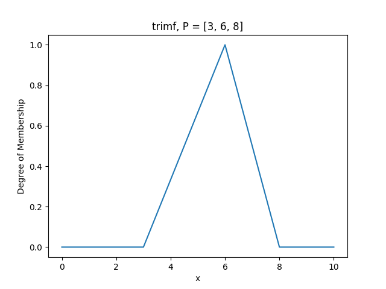

# fuzzylab
Python Fuzzy Logic library based on Octave Fuzzy Logic Toolkit 0.4.6, considered as a mostly MATLAB-compatible fuzzy logic toolkit for Octave.

The way to use the fuzzylab functions is based on Matlab R2022a Fuzzy Logic Toolbox functions.

This library is more mature compared to the first version and will receive periodic updates.

## Research work

[Fuzzy Logic Controller with Fuzzylab Python Library and the Robot Operating System for Autonomous Robot Navigation: A Practical Approach](https://doi.org/10.1007/978-3-030-35445-9_27)

## Installation

```
pip install fuzzylab
```

## Usage

In the folder [examples](examples) there are some code snippets and the equivalent matlab code for a starting point using the library.

We use `fl` as the alias for `fuzzylab`.

```python
import fuzzylab as fl
```

## Example

```python
import fuzzylab as fl
import matplotlib.pyplot as plt

x = fl.arange(0, 0.1, 10)
y = fl.trimf(x, [3, 6, 8])

plt.plot(x,y)
plt.title('trimf, P = [3, 6, 8]')
plt.xlabel('x')
plt.ylabel('Degree of Membership')
plt.ylim([-0.05, 1.05])
plt.show()
```



Also we can use a more matlab code style

```python
from fuzzylab import arange, trimf
from matplotlib.pyplot import plot, title, xlabel, ylabel, ylim, show

x = arange(0, 0.1, 10)
y = trimf(x, [3, 6, 8])

plot(x,y)
title('trimf, P = [3, 6, 8]')
xlabel('x')
ylabel('Degree of Membership')
ylim([-0.05, 1.05])
show()
```

## Citing fuzzylab

    @Inbook{Avelar2020,
      author="Avelar, Eduardo
      and Castillo, Oscar
      and Soria, Jos{\'e}",
      editor="Castillo, Oscar
      and Melin, Patricia
      and Kacprzyk, Janusz",
      title="Fuzzy Logic Controller with Fuzzylab Python Library and the Robot Operating System for Autonomous Robot Navigation: A Practical Approach",
      bookTitle="Intuitionistic and Type-2 Fuzzy Logic Enhancements in Neural and Optimization Algorithms: Theory and Applications",
      year="2020",
      publisher="Springer International Publishing",
      address="Cham",
      pages="355--369",
      isbn="978-3-030-35445-9",
      doi="10.1007/978-3-030-35445-9_27",
      url="https://doi.org/10.1007/978-3-030-35445-9_27"
    }
